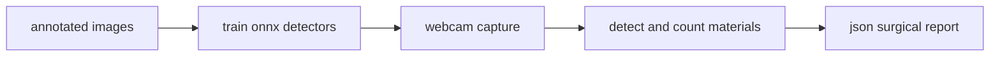
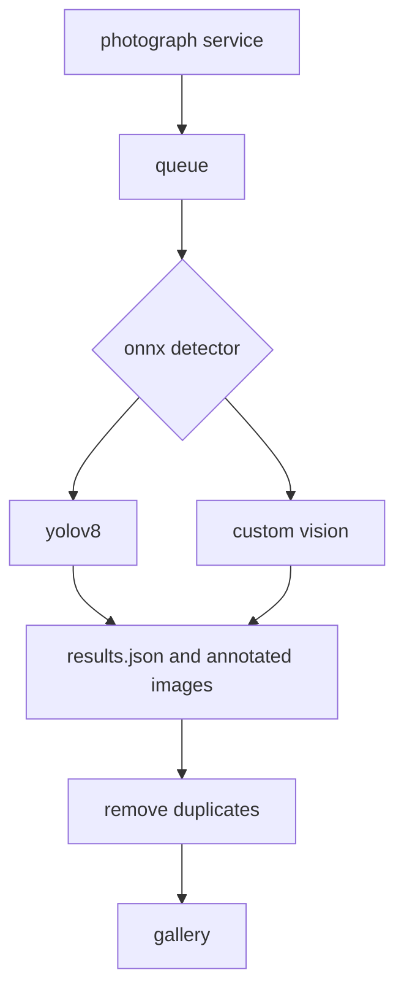

# survision.ai

## summary

survision.ai is a computer vision system that helps hospitals record surgical materials more reliably. a camera watches a tray, artificial intelligence identifies the visible instruments, and the system turns those observations into a time-stamped json report that can be connected to hospital software. the project trained and compared two detectors: yolov8 reached 92.87% precision and 75.30% recall, while custom vision reached 90.00% precision and 39.90% recall. the result is a working research prototype for reducing manual counting and documentation errors.

## methodology

the project followed a practical path from images to an auditable surgical report:

1. images of six surgical-material classes were collected and labelled with bounding boxes using cvat.
2. the dataset was used to fine-tune yolov8 and to train an azure custom vision detector. both models were exported as onnx files so they could run locally from c# without a permanent internet connection.
3. a webcam captured the tray at a configurable interval. each surgery was stored with room, start time, duration, and image-count metadata.
4. the same images were tested in three conditions: orderly handling, disorganized handling, and disorganized handling with unknown materials.
5. detections below a 50% confidence threshold were ignored. the remaining class, confidence, position, width, and height values were saved as json and used to summarize material usage.
6. repeated frames with the same detected-object pattern were removed to reduce storage, and the final records were exposed through an http api.

## architecture

survision.ai is a .net solution split into focused components. the user interface is a windows forms application that selects the operating room, starts or stops capture, shows an optional live detection view, lists previous surgeries, and exports json or a readable surgical description. the photograph service owns the webcam and writes timestamped images plus metadata.

after capture, the application creates a zip package and places it in a folder-based queue. a background windows service supervises five stages: `fila` validates incoming packages, `processando` runs inference, `processado` trims redundant frames, `galeria` stores completed surgeries, and `lixeira` receives invalid material. this design makes each step observable and keeps image capture separate from slower ai processing.

the prediction layer uses a shared `ipredictionservice` contract, so the processing service can choose between two interchangeable implementations:

- the yolov8 adapter uses yolodotnet and the local `yolomodel.onnx` file.
- the custom vision adapter uses microsoft ml and `azuremodel.onnx`, with class names read from `labels.txt`.

both adapters return the same normalized prediction model. each detection contains a class name, confidence, and normalized bounding box. the processing service draws detections on the images, groups them into a surgery timeline, calculates a compact hash for each frame, and serializes the complete result to `results.json`.

the web api is a lightweight asp.net core service. it reads completed records from the gallery and provides full surgery results or material-usage summaries by surgery id, room, and date. the repository also contains shared domain models, validation rules, drawing helpers, trained model files, and a validation project with test scenarios.

## results

the evaluation used 1,053 captured images: 579 in an orderly scenario, 310 in a disorganized scenario, and 164 in a highly disorganized scenario containing unknown objects. yolov8 produced the strongest overall balance, with 92.87% precision and 75.30% recall. custom vision was nearly as precise at 90.00%, but its 39.90% recall means it missed more relevant objects.

the tests also showed why the camera setup matters. both models lost performance when materials overlapped, were handled without a repeatable arrangement, or included classes absent from training. processing time grew approximately linearly with the number of images: 10 images took 9.361 seconds, 100 took 92.940 seconds, and 1,000 took 1,034.242 seconds. memory use was about 330 mb during processing. the prototype achieved its engineering goals, but a clinical or financial claim would require comparison with trained staff, broader data, and a formal cost analysis.
